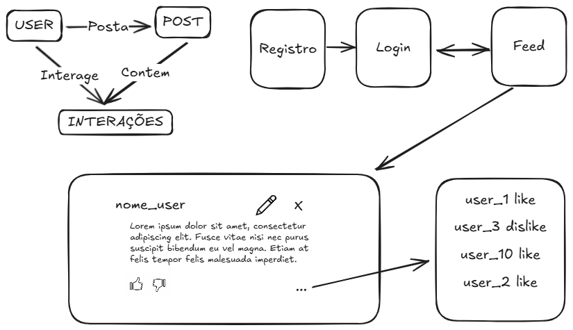

# Mini-Projeto 3

Encerraremos nossa etapa de aulas com um último projeto prático: uma rede social.

O objetivo dessa aplicação, é que vocês desenvolvam habilidades práticas no mundo fullstack. Dessa forma, utilizaremos todo o conteúdo aprendido nessa trilha prática de fullstack para modelar a rede social em um banco de dados e implementar um backend e um frontend.

## Requisitos

Não há um "gabarito" para esse projeto. Entretanto, há certas funcionalidades que são **obrigatórias**.

Logo, a sua implementação não precisa estar igual à minha ou à de terceiros. O que importa, e será avaliado, é: a entrega de todas as funcionalidades abaixo e a qualidade com que elas foram implementadas.

| Funcionalidade / Requisito                                                                                                                      | Obrigatório          | Entidades Envolvidas         |
| ----------------------------------------------------------------------------------------------------------------------------------------------- | -------------------- | ---------------------------- |
| Autenticação (Login e Registrar) apenas com nome e senha do usuário                                                                              | :white\_check\_mark: | Usuário                      |
| Usuários **não** podem possuir nomes iguais                                                                                                     | :white\_check\_mark: | Usuário                      |
| CRUD de postagens (criar, editar, excluir, listar)                                                                                              | :white\_check\_mark: | Usuário, Postagem            |
| O Usuário pode realizar apenas uma interação por postagem, porém pode alterá-la                                                 | :white\_check\_mark: | Usuário, Postagem, Interação |
| Exibir em cada postagem: nome do autor, conteúdo e lista completa de interações com autor e qual interação | :white\_check\_mark: | Usuário, Postagem, Interação |
| Usuários autenticados terão botões específicos nas postagens:<br>- **Autor:** botões Editar e Excluir<br>- **Não autor:** botões Like e Dislike | :white\_check\_mark: | Usuário, Postagem, Interação |
| Telas necessárias: Login, Registrar, Feed e Criar postagem<br>- O feed é a pagina principal. Nela contém todos os posts. | :white\_check\_mark: | Usuário, Postagem, Interação |
| Suporte a imagens ou vídeos nas postagens                                                                                                       | :x:                  | Postagem                     |

> Interações = like ou dislike.

## Exemplo

Este repositório é apenas um exemplo de implementação e, em caso de plágio, seu trabalho será descartado. Logo, utilize-o apenas para consulta e ideias.



### Para executar

#### Frontend

Necessário ter [node.js](https://nodejs.org/en/download) instalado:

```bash
cd front

npm install
npm run dev
```

#### Backend

Necessário ter [Python](https://www.python.org/downloads/) instalado:

```bash
pip install sqlmodel fastapi[standard]

cd back/src
python -m fastapi dev
```

## Referências e Links Úteis

- [FastAPI](https://fastapi.tiangolo.com/tutorial/sql-databases/)
- [Next](https://nextjs.org/docs)
- [shadcn](https://ui.shadcn.com/)
- [Repositório da aula Frontend](https://github.com/guilhermehuther/backend-basics/tree/fastapi)
- [Extensão do VSCode para requisições HTTP](https://marketplace.visualstudio.com/items?itemName=humao.rest-client)
- [Extensão do VSCode para vizualizar arquivos do sqllite](https://marketplace.visualstudio.com/items/?itemName=qwtel.sqlite-viewer)
